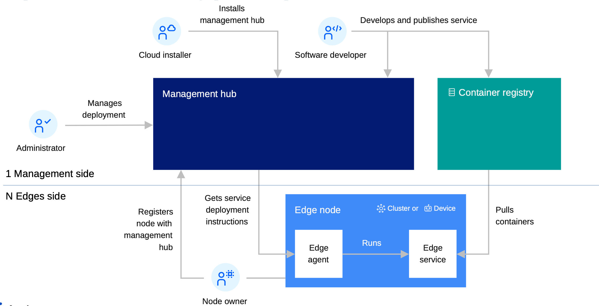
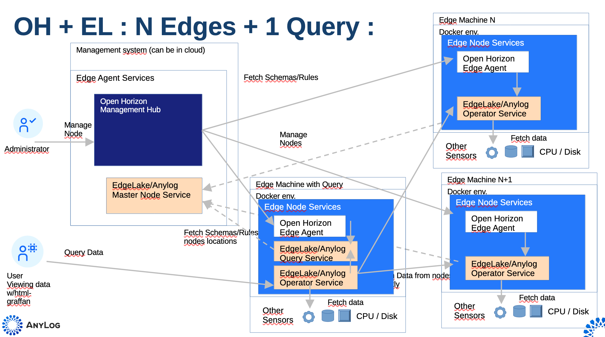
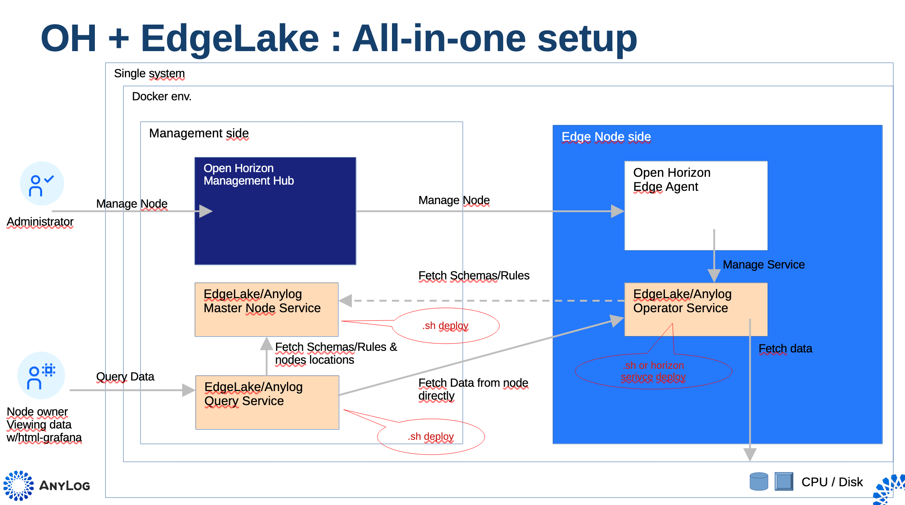

# AnyLog Service for OpenHorizon

AnyLog is a decentralized network to manage IoT/Edge data. Nodes are compute instances that execute the AnyLog
software and are part of a nodes network.

The AnyLog network uses one **Master** node (holds all network metadata), as many **Operator** nodes as required
(where data is stored), and at least one **Query** node (where queries are made — nodes can be dual-role
Query+Operator). The Query node knows from the metadata which Operators to contact and queries them peer-to-peer.

> **Note:** The Master node can also be replaced by a Blockchain service & contract — not covered here.

Adding AnyLog to Open Horizon deployments extends OH value by:
- Simple collection of node health data
- Extending queried data to other sensors useful to the user (e.g. machine RPMs)

---

## Architecture

In a typical Open Horizon deployment here are the main elements:


The simplest pattern for adding AnyLog is to co-locate the Master and Query nodes with the OH Management Hub:


A more practical approach puts the Query node(s) elsewhere, avoiding moving data to the Management Hub (peer-to-peer
collection). Multiple Query nodes are supported:


For demonstrating and testing on a single physical system:


---

## Repository Structure

```
anylog-service/
├── Makefile
├── deploy.sh                      ← docker lifecycle engine (can be run standalone, without make)
├── service.definition.json        ← base template (never modified directly)
├── service.policy.json            ← base template
├── node.policy.json               ← base template
└── docker-makefiles/
    ├── env2json.sh                ← generates per-instance JSON policy files
    ├── env2json.py                ← Python equivalent of env2json.sh
    ├── prep_configs.sh
    ├── build_docker_compose.sh
    ├── clean_configs.sh
    ├── docker-compose-files/
    │   └── <ANYLOG_TYPE>-docker-compose.yaml
    └── <ANYLOG_TYPE>/             ← one directory per node instance
        ├── node_configs.env       ← user-edited configuration
        ├── service.definition.json  ← generated by prep-service
        ├── service.policy.json      ← generated by prep-service
        └── node.policy.json         ← generated by prep-service
```

Each `<ANYLOG_TYPE>` directory is self-contained. Multiple instances (e.g. `anylog-generic`, `anylog-operator`,
`anylog-master`) can coexist on the same machine without conflicts — every `prep-service` run writes its JSON
files into its own subdirectory, using the `NODE_NAME` from that instance's `.env` as the service identity.

---

## Prerequisites

| Tool | Required for |
|---|---|
| `docker` or `podman` | All container operations |
| `docker compose` / `docker-compose` / `podman-compose` | Docker compose targets |
| `jq` | `prep-service` (JSON policy generation) |
| `hzn` (Open Horizon CLI) | All `publish-*`, `agent-run`, `deploy-check` targets |

The Makefile auto-detects `docker` vs `podman` and `docker compose` vs `docker-compose` vs `podman-compose`.
`hzn` is optional — all Docker compose targets work without it.

---

## Configuration

Each node type has its own directory under `docker-makefiles/` containing a `node_configs.env` file.
The key variables read at make-time are:

| Variable in `.env` | Purpose |
|---|---|
| `NODE_NAME` | Sets the container name and OpenHorizon service identity |
| `IMAGE` | Docker image repo (e.g. `anylogco/anylog-network`) |

All other variables are passed through to the container at runtime.

### Makefile variables

| Variable | Default | Description |
|---|---|---|
| `ANYLOG_TYPE` | `anylog-generic` | Subdirectory name under `docker-makefiles/`. Short forms (`generic`, `master`, `operator`, `query`, `publisher`, `standalone-operator`, `standalone-publisher`) are auto-resolved to `anylog-<type>` |
| `TAG` | `2.0.2606` | Docker image tag |
| `IMAGE` | `anylogco/anylog-network` | Docker image repo |
| `IS_MANUAL` | `false` | Use `docker run` instead of `docker compose` for the docker-lifecycle targets |
| `LICENSE_KEY` | *(none)* | AnyLog license key. If not set, `license-check` (run automatically by `up` and `prep-service`) prompts for it and writes it into `node_configs.env` |
| `PROMPT_LICENSE` | `true` | Whether to prompt for a license key when one isn't already saved |
| `TEST_CONN` | auto-resolved from `node_configs.env` | REST endpoint (`ip:port`) used by `test-status`/`test-node`/`test-network`/`check-processes` |
| `HZN_ORG_ID` | `myorg` | OpenHorizon organisation ID |
| `HZN_LISTEN_IP` | `127.0.0.1` | OpenHorizon listen IP |
| `SERVICE_VERSION` | same as `TAG` | OH service version |
| `HZN_EXCHANGE_USER_AUTH` | *(required for publish)* | OH exchange credentials |

---

## Volumes

Each AnyLog node uses three named Docker volumes, scoped to the `NODE_NAME` set in `node_configs.env`:

| Volume | Mount path | Purpose |
|---|---|---|
| `${NODE_NAME}-anylog` | `/app/AnyLog-Network/anylog` | AnyLog runtime state — active processes, in-flight data, and internal configuration generated at startup |
| `${NODE_NAME}-blockchain` | `/app/AnyLog-Network/blockchain` | Local copy of the blockchain/metadata ledger, synced from the Master node on a schedule |
| `${NODE_NAME}-data` | `/app/AnyLog-Network/data` | Persistent operator data — the actual time-series records stored by the node |

### Deployment scripts: Open Horizon vs Docker Compose

With plain Docker Compose you can bind-mount a local clone of the
[AnyLog deployment-scripts](https://github.com/AnyLog-co/deployment-scripts) repo directly into the container.
Open Horizon does not support this pattern cleanly for two reasons:

1. **Container lifecycle is managed by the Horizon agent** — you don't control when mounts occur relative to any
   init steps, so a bind-mount to a locally cloned repo can race or fail silently.
2. **Services start independently** — an init container approach (e.g. BusyBox cloning the repo before the main
   container starts) is unreliable because the Horizon agent may start the main service before the repo clone
   finishes, or the cloned path may be hidden once the volume mount lands.

**Recommended approach:** fork [https://github.com/AnyLog-co/deployment-scripts](https://github.com/AnyLog-co/deployment-scripts)
and point AnyLog at your fork via `node_configs.env`:

```dotenv
# Github repo to use for configuring / deploying node
DEPLOYMENTS_REPO="https://github.com/<your-org>/deployment-scripts"

# Branch associated with git repo
DEPLOYMENTS_BRANCH="main"
```

The node pulls the repo at startup, so any configuration changes are applied on the next container restart
without re-publishing the OH service.

---

## Usage

### Docker Compose

`LICENSE_KEY` doesn't need to be set manually — if it's missing from `node_configs.env`, `make up` prompts for
it (interactively, via `/dev/tty`) and writes it back into the file so future runs skip the prompt. Pass
`--license-key` non-interactively (e.g. in CI) via `LICENSE_KEY=... make up ...`, or set `PROMPT_LICENSE=false`
to fail fast instead of prompting.

```bash
# Pull image from Docker Hub
make pull ANYLOG_TYPE=anylog-generic

# Preview — generate docker-compose.yaml without starting
make dry-run ANYLOG_TYPE=anylog-generic

# Start (prompts for LICENSE_KEY on first run if not already set)
make up ANYLOG_TYPE=anylog-generic TAG=latest

# Stop
make down ANYLOG_TYPE=anylog-generic

# Stop and remove volumes
make clean ANYLOG_TYPE=anylog-generic

# Stop, remove volumes and image
make clean-all ANYLOG_TYPE=anylog-generic

# Logs
make logs   ANYLOG_TYPE=anylog-generic
make logs-f ANYLOG_TYPE=anylog-generic   # follow

# Attach to running container (interactive AnyLog CLI)
make attach ANYLOG_TYPE=anylog-generic

# Open bash shell in container (anylog user, or root)
make exec      ANYLOG_TYPE=anylog-generic
make exec-root ANYLOG_TYPE=anylog-generic
```

Use `IS_MANUAL=true` to fall back to a plain `docker run` instead of `docker compose` (useful when a compose
file isn't wanted, e.g. constrained environments):

```bash
make up ANYLOG_TYPE=anylog-generic IS_MANUAL=true
```

### Testing

```bash
# Run get-status + test-node + test-network in sequence
make full-test ANYLOG_TYPE=anylog-generic

make test-status      ANYLOG_TYPE=anylog-generic   # `get status where format=json`
make test-node        ANYLOG_TYPE=anylog-generic   # `test node`
make test-network     ANYLOG_TYPE=anylog-generic   # `test network`
make check-processes  ANYLOG_TYPE=anylog-generic   # `get processes`
```

`TEST_CONN` is auto-resolved from the node's `ANYLOG_REST_PORT` in `node_configs.env` (falling back to
`127.0.0.1:<port>`) — override it directly if testing against a remote node:

```bash
make full-test TEST_CONN=192.168.1.10:32149
```

### OpenHorizon

```bash
# Set service version
export SERVICE_VERSION=1.1

# Generate service.definition.json, service.policy.json, service.deployment.json and node.policy.json
# into docker-makefiles/<ANYLOG_TYPE>/
# (also resolves LICENSE_KEY first — prompts and saves it into node_configs.env if missing)
make prep-service ANYLOG_TYPE=anylog-generic TAG=latest

# Publish service + policies, then register the agent (full workflow)
make full-deploy ANYLOG_TYPE=anylog-generic TAG=latest

# Publish services and policies only (no agent registration)
make publish ANYLOG_TYPE=anylog-generic

# Register agent against already-published policies
make deploy ANYLOG_TYPE=anylog-generic

# Start agent only (after policies are already published)
make agent-run ANYLOG_TYPE=anylog-generic

# Unregister agent, remove all policies/service, and wipe image+volumes
make hzn-clean-all ANYLOG_TYPE=anylog-generic

# Check agreement list
make hzn-agreement-list

# View logs for container running under Open Horizon
make hzn-logs ANYLOG_TYPE=anylog-generic

# Validate deployment against all policy files
make deploy-check ANYLOG_TYPE=anylog-generic
```

If you only need to resolve/update the license key without generating anything else:

```bash
make license-check ANYLOG_TYPE=anylog-generic
```

Granular teardown targets (useful when only part of a deployment needs to be undone):

```bash
make unregister-agent            # unregister agent from OpenHorizon
make remove-service            ANYLOG_TYPE=anylog-generic  # remove service from hzn exchange
make remove-service-policy      ANYLOG_TYPE=anylog-generic  # remove service policy
make remove-deployment-policy   ANYLOG_TYPE=anylog-generic  # remove deployment policy
```

Diagnostics for a registered node:

```bash
make hzn-status           # agreement list + event log + service log, in sequence
make hzn-agreement-list   # check agreement list
make hzn-event-list       # list event logs
make hzn-logs ANYLOG_TYPE=anylog-generic   # view service logs
```

`prep-build` is a temporary bridge target — AnyLog's current release tags aren't in the `#.#.####` format
Open Horizon expects, so this pulls the image under its normal `TAG`, retags it to a valid OH version string,
and pushes that instead:

```bash
make prep-build ANYLOG_TYPE=anylog-generic TAG=pre-develop
# then: make full-deploy ANYLOG_TYPE=anylog-generic TAG=<printed OH_VERSION>
```

Granular publish targets (useful when iterating on a single policy):

```bash
make publish-service         ANYLOG_TYPE=anylog-generic   # publish service definition
make publish-service-policy  ANYLOG_TYPE=anylog-generic   # publish service policy
make publish-deployment-policy ANYLOG_TYPE=anylog-generic # publish deployment policy
make publish-version         ANYLOG_TYPE=anylog-generic   # update version only
```

Multiple instances on the same machine — each with its own identity and policy files:

```bash
make prep-service ANYLOG_TYPE=anylog-master    TAG=latest
make prep-service ANYLOG_TYPE=anylog-operator  TAG=pre-develop
make prep-service ANYLOG_TYPE=anylog-query     TAG=latest
```

Update the policy on an already-registered Open Horizon node:

```bash
hzn unregister
hzn register -n nodename -f docker-makefiles/<ANYLOG_TYPE>/node.policy.json
```

### Diagnostics

```bash
# Show all resolved variable values (docker + Open Horizon)
make check-vars ANYLOG_TYPE=anylog-generic

# Attach to running container (interactive AnyLog CLI)
make attach ANYLOG_TYPE=anylog-generic

# Open bash shell in container
make exec ANYLOG_TYPE=anylog-generic
```

All docker-lifecycle targets can also be run without `make`, directly via `deploy.sh`:

```bash
bash deploy.sh up --type operator --tag latest
bash deploy.sh check-vars --type query
bash deploy.sh help
```

---

## 📌 Our valuable contributors 👩‍💻👨‍💻

<table>
  <tr>
    <a href="https://github.com/open-horizon-services/service-anylog/graphs/contributors">
      
    </a>
  </tr>
</table>